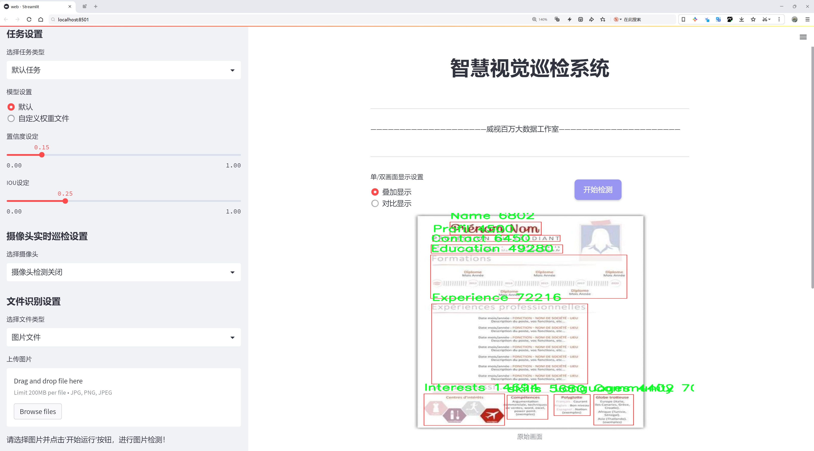
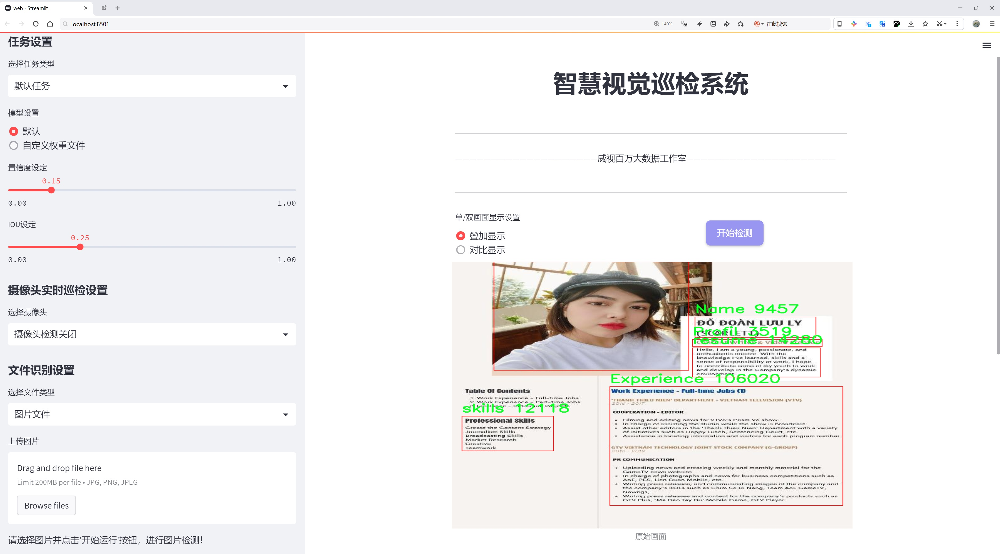
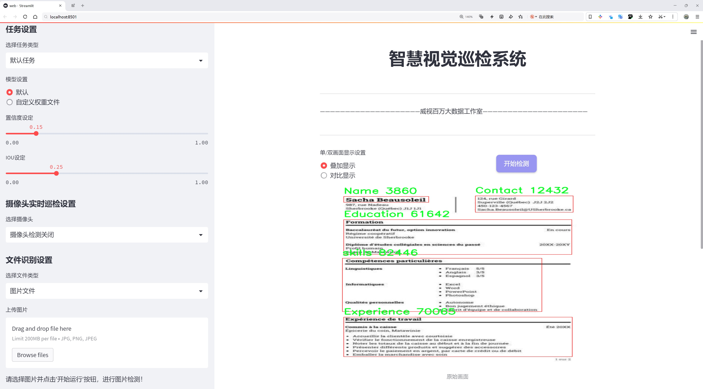
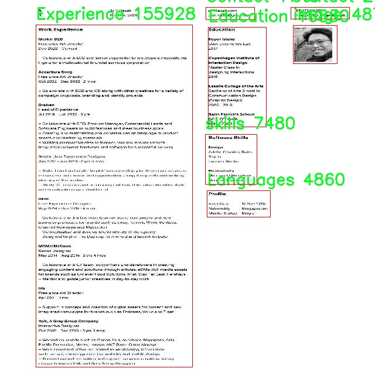
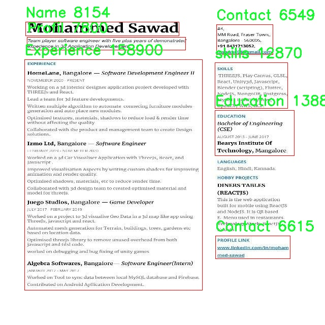
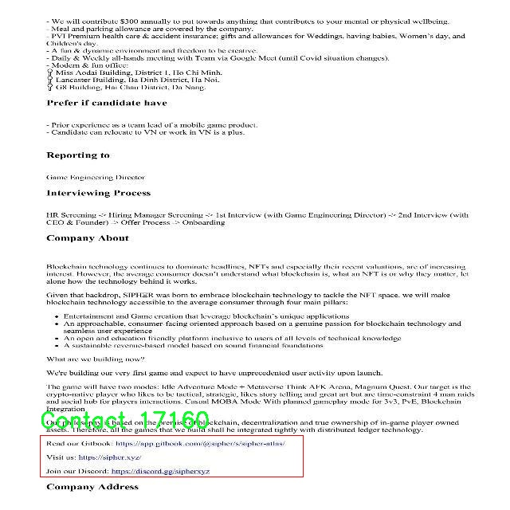
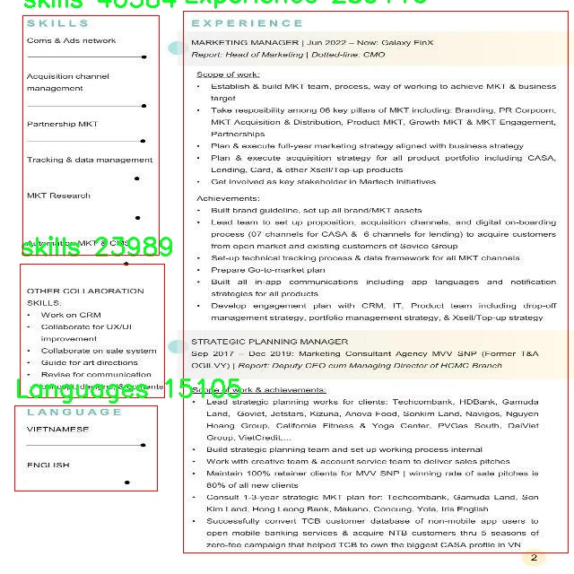
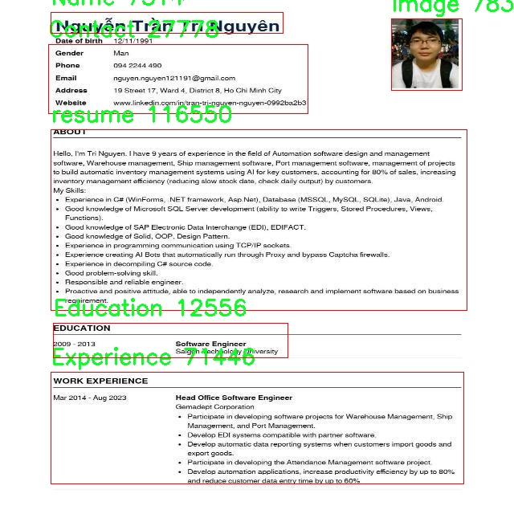

# 简历信息提取检测系统源码分享
 # [一条龙教学YOLOV8标注好的数据集一键训练_70+全套改进创新点发刊_Web前端展示]

### 1.研究背景与意义

项目参考[AAAI Association for the Advancement of Artificial Intelligence](https://gitee.com/qunmasj/projects)

项目来源[AACV Association for the Advancement of Computer Vision](https://kdocs.cn/l/cszuIiCKVNis)

研究背景与意义

随着信息技术的迅猛发展，尤其是人工智能和机器学习的广泛应用，简历信息提取系统的研究逐渐成为一个重要的研究领域。简历作为求职者展示自身能力和经验的重要文档，其信息的准确提取对于招聘流程的高效性和公正性具有重要意义。传统的简历筛选方式往往依赖人工审核，不仅耗时耗力，而且容易受到主观因素的影响，导致优秀人才的流失。因此，开发一种高效、准确的简历信息提取系统显得尤为重要。

在这一背景下，基于改进YOLOv8的简历信息提取系统应运而生。YOLO（You Only Look Once）系列模型以其高效的实时目标检测能力而闻名，尤其在处理复杂图像时表现出色。YOLOv8作为该系列的最新版本，具备更强的特征提取能力和更高的检测精度，能够在多种场景下进行快速而准确的目标识别。通过对YOLOv8模型的改进，结合简历这一特定应用场景，可以有效提升简历信息提取的效率和准确性。

本研究所使用的数据集包含1700张简历图像，涵盖14个类别，包括成就、证书、社区活动、联系方式、教育背景、工作经历、兴趣爱好、语言能力、姓名、个人简介、项目经历、图像、简历整体以及技能等。这些类别的多样性使得模型在训练过程中能够学习到丰富的特征，从而在实际应用中更好地适应不同类型的简历。通过对这些类别的精确识别和提取，系统能够自动化地生成求职者的关键信息，为招聘人员提供高效的筛选工具。

此外，随着企业对人才选拔标准的日益严格，简历的格式和内容也变得越来越多样化和复杂化。传统的文本解析方法在面对图像化简历时常常显得力不从心，而基于YOLOv8的目标检测方法则能够在图像层面进行处理，克服了这一局限性。通过对简历图像进行目标检测和信息提取，系统不仅能够识别文本信息，还能够提取图像、图表等多种形式的信息，极大地丰富了数据获取的维度。

综上所述，基于改进YOLOv8的简历信息提取系统不仅能够提升简历筛选的效率和准确性，还能够适应多样化的简历格式，为招聘流程的智能化和自动化提供了有力支持。该研究的意义在于推动招聘行业的信息化进程，降低人力成本，提高招聘效率，最终实现人才与岗位的最佳匹配。通过这一系统的研发与应用，将为未来的招聘实践提供新的思路和方法，具有重要的理论价值和实际应用前景。

### 2.图片演示







##### 注意：由于此博客编辑较早，上面“2.图片演示”和“3.视频演示”展示的系统图片或者视频可能为老版本，新版本在老版本的基础上升级如下：（实际效果以升级的新版本为准）

  （1）适配了YOLOV8的“目标检测”模型和“实例分割”模型，通过加载相应的权重（.pt）文件即可自适应加载模型。

  （2）支持“图片识别”、“视频识别”、“摄像头实时识别”三种识别模式。

  （3）支持“图片识别”、“视频识别”、“摄像头实时识别”三种识别结果保存导出，解决手动导出（容易卡顿出现爆内存）存在的问题，识别完自动保存结果并导出到tempDir中。

  （4）支持Web前端系统中的标题、背景图等自定义修改，后面提供修改教程。

  另外本项目提供训练的数据集和训练教程,暂不提供权重文件（best.pt）,需要您按照教程进行训练后实现图片演示和Web前端界面演示的效果。

### 3.视频演示

[3.1 视频演示](https://www.bilibili.com/video/BV1XjshefEud/)

### 4.数据集信息展示

##### 4.1 本项目数据集详细数据（类别数＆类别名）

nc: 14
names: ['Achievement', 'Certifications', 'Community', 'Contact', 'Education', 'Experience', 'Interests', 'Languages', 'Name', 'Profil', 'Projects', 'image', 'resume', 'skills']


##### 4.2 本项目数据集信息介绍

数据集信息展示

在当今信息化快速发展的时代，简历作为求职者展示个人能力和经历的重要工具，其信息提取的准确性和高效性显得尤为重要。为此，我们构建了一个名为“Resume section”的数据集，旨在为改进YOLOv8的简历信息提取系统提供强有力的支持。该数据集的设计充分考虑了简历的多样性和复杂性，涵盖了14个不同的类别，确保能够全面、准确地提取简历中的关键信息。

“Resume section”数据集的类别包括：Achievement（成就）、Certifications（证书）、Community（社区活动）、Contact（联系方式）、Education（教育背景）、Experience（工作经历）、Interests（兴趣爱好）、Languages（语言能力）、Name（姓名）、Profil（个人简介）、Projects（项目经历）、image（图像）、resume（简历整体）、skills（技能）。这些类别不仅涵盖了求职者在简历中可能展示的各类信息，还考虑到了不同求职者的个性化需求和行业特性，使得数据集具有广泛的适用性。

在数据集的构建过程中，我们收集了大量真实的简历样本，确保数据的多样性和代表性。每个类别中的样本均经过精心标注，以确保信息提取系统能够准确识别和分类。比如，在“Experience”类别中，我们不仅标注了求职者的工作经历，还记录了每段经历的时间、职位和公司名称等信息，以便系统能够更好地理解和提取相关内容。同样，在“Education”类别中，我们标注了求职者的学历、学校名称及专业等信息，为系统提供了丰富的上下文。

此外，数据集中还包含了“image”和“resume”类别，这些类别的设计旨在帮助系统处理简历的整体布局和视觉信息。通过对简历图像的分析，系统能够识别出不同信息块的位置和结构，从而提升信息提取的准确性。这种多维度的信息展示方式，使得“Resume section”数据集不仅限于文本信息的提取，还扩展到了图像信息的理解，极大地增强了系统的智能化水平。

为了进一步提高数据集的有效性，我们还进行了数据增强处理，包括旋转、缩放、裁剪等操作，以模拟不同格式和风格的简历。这种处理方式使得模型在训练过程中能够接触到更多样化的样本，从而提升其在实际应用中的鲁棒性和适应性。

综上所述，“Resume section”数据集的构建充分考虑了简历信息提取的多样性和复杂性，通过细致的类别划分和丰富的样本标注，为改进YOLOv8的简历信息提取系统提供了坚实的基础。该数据集不仅有助于提升信息提取的准确性和效率，也为未来相关研究提供了宝贵的资源和参考。随着技术的不断进步，我们期待该数据集能够在求职者与招聘者之间架起更为高效的沟通桥梁，推动招聘行业的智能化发展。











### 5.全套项目环境部署视频教程（零基础手把手教学）

[5.1 环境部署教程链接（零基础手把手教学）](https://www.ixigua.com/7404473917358506534?logTag=c807d0cbc21c0ef59de5)


[5.2 安装Python虚拟环境创建和依赖库安装视频教程链接（零基础手把手教学）](https://www.ixigua.com/7404474678003106304?logTag=1f1041108cd1f708b01a)

### 6.手把手YOLOV8训练视频教程（零基础小白有手就能学会）

[6.1 手把手YOLOV8训练视频教程（零基础小白有手就能学会）](https://www.ixigua.com/7404477157818401292?logTag=d31a2dfd1983c9668658)

### 7.70+种全套YOLOV8创新点代码加载调参视频教程（一键加载写好的改进模型的配置文件）

[7.1 70+种全套YOLOV8创新点代码加载调参视频教程（一键加载写好的改进模型的配置文件）](https://www.ixigua.com/7404478314661806627?logTag=29066f8288e3f4eea3a4)

### 8.70+种全套YOLOV8创新点原理讲解（非科班也可以轻松写刊发刊，V10版本正在科研待更新）

由于篇幅限制，每个创新点的具体原理讲解就不一一展开，具体见下列网址中的创新点对应子项目的技术原理博客网址【Blog】：


[8.1 70+种全套YOLOV8创新点原理讲解链接](https://gitee.com/qunmasj/good)

### 9.系统功能展示（检测对象为举例，实际内容以本项目数据集为准）

图9.1.系统支持检测结果表格显示

  图9.2.系统支持置信度和IOU阈值手动调节

  图9.3.系统支持自定义加载权重文件best.pt(需要你通过步骤5中训练获得)

  图9.4.系统支持摄像头实时识别

  图9.5.系统支持图片识别

  图9.6.系统支持视频识别

  图9.7.系统支持识别结果文件自动保存

  图9.8.系统支持Excel导出检测结果数据


### 10.原始YOLOV8算法原理

原始YOLOv8算法原理

YOLOv8算法是Ultralytics公司在2023年推出的一个重要版本，代表了YOLO系列在目标检测领域的又一次重大飞跃。作为YOLO系列的最新成员，YOLOv8在设计理念、网络结构和性能优化等方面进行了全面的改进，旨在提供更高的检测精度和更快的推理速度，同时保持易用性和灵活性。YOLOv8的核心理念依然围绕着快速、准确和高效的目标检测展开，但在具体实现上却融入了许多新的技术和设计思想，使其在众多同类算法中脱颖而出。

首先，YOLOv8在输入图像处理方面引入了自适应图片缩放的策略，以应对不同长宽比的图像。在传统的目标检测算法中，输入图像的尺寸通常是固定的，这会导致在处理不同尺寸和比例的图像时信息的损失或冗余。而YOLOv8通过将图像的长边按比例缩放到指定尺寸，然后对短边进行填充的方式，最大限度地减少了填充区域的影响，从而提高了目标检测的效率和准确性。此外，在训练阶段，YOLOv8采用了Mosaic图像增强技术，通过将四张不同的图像随机缩放并拼接成一张新图像，促使模型学习到更多的特征和位置信息，从而有效提升了模型的泛化能力和预测精度。

在网络结构方面，YOLOv8对主干网络（Backbone）进行了显著的改进。YOLOv8采用了C2F模块来替代YOLOv5中的C3模块，C2F模块通过引入更多的并行梯度流分支，不仅保持了网络的轻量化，还增强了特征提取的能力。C2F模块的设计灵感来源于YOLOv7中的ELAN模块，旨在通过更丰富的梯度信息来提升模型的整体性能。与以往的模块相比，C2F模块能够更有效地捕捉不同尺度的特征，使得YOLOv8在处理复杂场景时表现得更加出色。

YOLOv8的Neck部分同样经历了重要的结构调整。与YOLOv5相比，YOLOv8去除了多余的卷积连接层，直接对主干网络不同阶段输出的特征进行上采样（Upsample），从而简化了网络结构，提高了计算效率。这种简化不仅降低了模型的复杂度，还加快了推理速度，使得YOLOv8在实时目标检测任务中具备了更强的竞争力。

在Head部分，YOLOv8的创新尤为显著。YOLOv8采用了解耦合头（Decoupled-Head）结构，将目标检测和分类任务分开处理。这一设计的优势在于能够针对不同任务优化网络的学习过程，从而提高了检测精度。同时，YOLOv8摒弃了传统的Anchor-Based方法，转而采用Anchor-Free的策略，将目标检测问题转化为关键点检测。这一转变不仅简化了模型的设计，还提高了模型的泛化能力，使其在面对不同数据集时能够更灵活地适应。

在损失函数的设计上，YOLOv8也进行了创新。YOLOv8中取消了对象性（Objectness）分支，采用了BCELoss作为分类损失，并在边界框回归分支中引入了DFL（Distribution Focal Loss）和CIoU（Complete Intersection over Union）损失。这种新的损失函数设计旨在提高模型对目标位置的聚焦能力，使得网络能够更快地收敛到准确的预测结果。

总的来说，YOLOv8在多个方面的创新使其成为当前目标检测领域的佼佼者。通过引入自适应图像缩放、C2F模块、解耦合头结构以及Anchor-Free检测方法，YOLOv8不仅提升了模型的性能和灵活性，还在实际应用中展现出了更强的适应性和效率。作为YOLO系列的最新版本，YOLOv8不仅延续了前几代模型的优良传统，还在此基础上进行了深入的优化和改进，标志着目标检测技术的又一次进步。无论是在学术研究还是工业应用中，YOLOv8都展现出了广泛的应用前景和潜力。


### 11.项目核心源码讲解（再也不用担心看不懂代码逻辑）

#### 11.1 70+种YOLOv8算法改进源码大全和调试加载训练教程（非必要）\ultralytics\engine\trainer.py

以下是经过简化和注释的核心代码部分，保留了最重要的功能和逻辑。注释详细解释了每个部分的作用。

```python
import os
import time
import torch
from torch import distributed as dist
from torch import nn, optim
from torch.cuda import amp
from ultralytics.cfg import get_cfg, get_save_dir
from ultralytics.utils import LOGGER, RANK, callbacks
from ultralytics.utils.torch_utils import init_seeds, select_device

class BaseTrainer:
    """
    BaseTrainer类用于创建训练器的基类。
    包含模型训练所需的基本功能和属性。
    """

    def __init__(self, cfg='default_cfg.yaml', overrides=None):
        """
        初始化BaseTrainer类。

        Args:
            cfg (str): 配置文件路径。
            overrides (dict): 配置覆盖选项。
        """
        self.args = get_cfg(cfg, overrides)  # 获取配置
        self.device = select_device(self.args.device)  # 选择训练设备
        init_seeds(self.args.seed)  # 初始化随机种子
        self.model = None  # 模型实例
        self.optimizer = None  # 优化器
        self.epochs = self.args.epochs  # 训练轮数
        self.start_epoch = 0  # 起始轮数
        self.callbacks = callbacks.get_default_callbacks()  # 获取默认回调

        # 创建保存目录
        self.save_dir = get_save_dir(self.args)
        if RANK in (-1, 0):
            self.save_dir.mkdir(parents=True, exist_ok=True)  # 创建保存目录

    def train(self):
        """开始训练过程。"""
        world_size = len(self.args.device.split(',')) if isinstance(self.args.device, str) else 1
        if world_size > 1:
            self._setup_ddp(world_size)  # 设置分布式训练
        self._setup_train(world_size)  # 设置训练参数

        for epoch in range(self.start_epoch, self.epochs):
            self.epoch = epoch
            self.model.train()  # 设置模型为训练模式
            for batch in self.get_dataloader():  # 获取数据加载器
                self.optimizer.zero_grad()  # 清空梯度
                loss = self.model(batch)  # 前向传播计算损失
                loss.backward()  # 反向传播
                self.optimizer.step()  # 更新参数

            if RANK in (-1, 0):
                LOGGER.info(f'Epoch {epoch + 1}/{self.epochs} completed.')  # 日志记录

    def _setup_ddp(self, world_size):
        """初始化分布式数据并行（DDP）参数。"""
        dist.init_process_group('nccl', rank=RANK, world_size=world_size)  # 初始化进程组

    def _setup_train(self, world_size):
        """设置训练所需的模型和优化器。"""
        self.model = self.get_model()  # 获取模型
        self.optimizer = optim.Adam(self.model.parameters(), lr=self.args.lr)  # 创建优化器

    def get_model(self):
        """加载或创建模型。"""
        # 这里可以根据需要加载模型
        model = nn.Sequential(nn.Linear(10, 10))  # 示例模型
        return model

    def get_dataloader(self):
        """获取数据加载器。"""
        # 这里可以根据需要返回数据加载器
        return [torch.randn(10) for _ in range(100)]  # 示例数据

# 使用示例
trainer = BaseTrainer(cfg='config.yaml')
trainer.train()
```

### 代码说明
1. **导入必要的库**：导入了PyTorch和Ultralytics库中需要的模块。
2. **BaseTrainer类**：这是一个训练器的基类，负责模型的训练过程。
3. **初始化方法**：在初始化时，加载配置、选择设备、初始化随机种子、创建保存目录等。
4. **训练方法**：包含训练的主循环，遍历每个epoch并处理每个batch的训练。
5. **分布式训练设置**：如果使用多GPU训练，初始化分布式进程组。
6. **模型和优化器设置**：在训练开始前设置模型和优化器。
7. **数据加载器**：提供了一个简单的示例数据加载器。

以上代码保留了核心的训练逻辑，并进行了详细的中文注释，以便于理解和后续扩展。

这个文件是Ultralytics YOLO（You Only Look Once）模型的训练器实现，主要用于训练YOLOv8模型。代码中包含了训练过程的多个重要组成部分，包括模型的初始化、数据集的处理、训练过程的管理、模型的保存与恢复等。

首先，文件中定义了一个`BaseTrainer`类，这是一个基础训练器类，提供了训练YOLO模型所需的基本功能。类的属性包括配置参数、模型、数据集、优化器、损失函数、学习率调度器等。这些属性在初始化时通过传入的配置文件和参数进行设置。

在`__init__`方法中，首先调用`get_cfg`函数获取配置参数，并检查是否需要从之前的检查点恢复训练。接着，选择设备（CPU或GPU）进行训练，并创建保存结果和权重的目录。然后，通过`check_cls_dataset`和`check_det_dataset`函数检查数据集的有效性，并根据任务类型（分类、检测等）加载相应的数据集。

`train`方法是训练的入口，首先确定使用的设备数量（单GPU或多GPU），然后根据设备数量选择训练方式。如果是多GPU训练，则生成分布式数据并行（DDP）的命令，并通过子进程运行。如果是单GPU训练，则直接调用`_do_train`方法进行训练。

在`_do_train`方法中，首先进行模型和数据加载的设置，包括创建数据加载器、优化器和学习率调度器。然后进入训练循环，逐个批次地进行前向传播、计算损失、反向传播和优化。训练过程中还会记录和打印当前的损失值、学习率等信息，并在每个epoch结束时进行验证和模型保存。

此外，`BaseTrainer`类还提供了多个辅助方法，例如`save_model`用于保存模型的检查点，`validate`用于在验证集上评估模型性能，`build_optimizer`用于构建优化器等。这些方法使得训练过程更加灵活和可控。

总体而言，这个文件实现了YOLOv8模型训练的核心逻辑，涵盖了从数据准备到模型训练和评估的完整流程，适合用于目标检测等计算机视觉任务。

#### 11.2 70+种YOLOv8算法改进源码大全和调试加载训练教程（非必要）\ultralytics\utils\callbacks\__init__.py

以下是代码中最核心的部分，并附上详细的中文注释：

```python
# 导入所需的函数和模块
from .base import add_integration_callbacks, default_callbacks, get_default_callbacks

# 定义模块的公开接口，指定可以被外部访问的对象
__all__ = 'add_integration_callbacks', 'default_callbacks', 'get_default_callbacks'
```

### 注释说明：

1. `from .base import add_integration_callbacks, default_callbacks, get_default_callbacks`：
   - 这一行代码从当前包的 `base` 模块中导入了三个函数或变量：`add_integration_callbacks`、`default_callbacks` 和 `get_default_callbacks`。这些函数或变量可能用于处理回调（callbacks）相关的功能。

2. `__all__ = 'add_integration_callbacks', 'default_callbacks', 'get_default_callbacks'`：
   - 这一行定义了模块的公开接口（`__all__`），它是一个字符串元组，列出了可以被外部访问的名称。当使用 `from module import *` 语句时，只有在 `__all__` 中列出的名称会被导入。这有助于控制模块的命名空间，避免不必要的名称泄露。

这个程序文件是一个Python模块，属于Ultralytics YOLO项目的一部分，主要用于处理回调函数的相关功能。文件的开头有一个注释，表明该项目是Ultralytics YOLO，遵循AGPL-3.0许可证。

在文件中，首先从同一目录下的`base`模块导入了三个函数：`add_integration_callbacks`、`default_callbacks`和`get_default_callbacks`。这些函数可能用于添加集成回调、获取默认回调等功能，具体实现需要查看`base`模块的代码。

最后，使用`__all__`变量定义了模块的公共接口，这意味着当使用`from module import *`语句时，只会导入`add_integration_callbacks`、`default_callbacks`和`get_default_callbacks`这三个函数。这种做法有助于控制模块的可见性，避免不必要的名称冲突。

总体来看，这个文件的功能是组织和提供与回调相关的工具，方便在YOLO算法的训练和推理过程中使用。

#### 11.3 ui.py

```python
import sys
import subprocess

def run_script(script_path):
    """
    使用当前 Python 环境运行指定的脚本。

    Args:
        script_path (str): 要运行的脚本路径

    Returns:
        None
    """
    # 获取当前 Python 解释器的路径
    python_path = sys.executable

    # 构建运行命令，使用 streamlit 运行指定的脚本
    command = f'"{python_path}" -m streamlit run "{script_path}"'

    # 执行命令
    result = subprocess.run(command, shell=True)
    # 检查命令执行结果，如果返回码不为0，则表示出错
    if result.returncode != 0:
        print("脚本运行出错。")


# 实例化并运行应用
if __name__ == "__main__":
    # 指定要运行的脚本路径
    script_path = "web.py"  # 这里可以直接指定脚本名，假设在当前目录下

    # 运行脚本
    run_script(script_path)
```

### 代码核心部分注释说明：

1. **导入模块**：
   - `sys`：用于访问与 Python 解释器紧密相关的变量和函数。
   - `subprocess`：用于执行外部命令和程序。

2. **定义 `run_script` 函数**：
   - 该函数接收一个参数 `script_path`，表示要运行的 Python 脚本的路径。
   - 使用 `sys.executable` 获取当前 Python 解释器的路径，以确保使用正确的 Python 环境来运行脚本。
   - 构建一个命令字符串，使用 `streamlit` 模块来运行指定的脚本。
   - 使用 `subprocess.run` 执行构建的命令，并通过 `shell=True` 允许在 shell 中执行。
   - 检查命令的返回码，如果不为0，表示脚本运行出错，并打印错误信息。

3. **主程序入口**：
   - 在 `if __name__ == "__main__":` 块中，指定要运行的脚本路径（在此示例中为 `web.py`）。
   - 调用 `run_script` 函数来执行指定的脚本。

这个程序文件的主要功能是通过当前的 Python 环境来运行一个指定的脚本，具体来说是运行一个名为 `web.py` 的脚本。文件首先导入了必要的模块，包括 `sys`、`os` 和 `subprocess`，以及一个自定义的路径处理模块 `abs_path`。

在 `run_script` 函数中，首先获取当前 Python 解释器的路径，这样可以确保使用正确的 Python 环境来执行脚本。接着，构建一个命令字符串，该命令使用 `streamlit` 模块来运行指定的脚本。`streamlit` 是一个用于构建数据应用的流行库，命令的格式为 `python -m streamlit run script_path`。

然后，使用 `subprocess.run` 方法来执行这个命令。该方法会在一个新的 shell 中运行命令，并等待其完成。如果脚本运行过程中出现错误，返回的状态码将不为零，程序会打印出“脚本运行出错”的提示信息。

在文件的最后部分，使用 `if __name__ == "__main__":` 语句来确保当该文件作为主程序运行时，才会执行后面的代码。在这里，首先调用 `abs_path` 函数来获取 `web.py` 的绝对路径，然后调用 `run_script` 函数来运行这个脚本。

总体来说，这个程序文件的功能是封装了一个简单的接口，用于运行一个特定的 Python 脚本，并处理可能出现的错误。

#### 11.4 code\ultralytics\models\sam\build.py

以下是经过简化和注释的核心代码部分：

```python
import torch
from functools import partial
from ultralytics.utils.downloads import attempt_download_asset
from .modules.decoders import MaskDecoder
from .modules.encoders import ImageEncoderViT, PromptEncoder
from .modules.sam import Sam
from .modules.tiny_encoder import TinyViT
from .modules.transformer import TwoWayTransformer

def _build_sam(encoder_embed_dim, encoder_depth, encoder_num_heads, encoder_global_attn_indexes, checkpoint=None, mobile_sam=False):
    """构建选定的SAM模型架构。"""
    
    # 定义一些模型参数
    prompt_embed_dim = 256  # 提示嵌入维度
    image_size = 1024  # 输入图像大小
    vit_patch_size = 16  # ViT的补丁大小
    image_embedding_size = image_size // vit_patch_size  # 图像嵌入大小

    # 根据是否为移动SAM选择不同的图像编码器
    image_encoder = (
        TinyViT(
            img_size=image_size,
            in_chans=3,
            num_classes=1000,
            embed_dims=encoder_embed_dim,
            depths=encoder_depth,
            num_heads=encoder_num_heads,
            window_sizes=[7, 7, 14, 7],
            mlp_ratio=4.0,
            drop_rate=0.0,
            drop_path_rate=0.0,
            use_checkpoint=False,
            mbconv_expand_ratio=4.0,
            local_conv_size=3,
            layer_lr_decay=0.8,
        ) if mobile_sam else ImageEncoderViT(
            depth=encoder_depth,
            embed_dim=encoder_embed_dim,
            img_size=image_size,
            mlp_ratio=4,
            norm_layer=partial(torch.nn.LayerNorm, eps=1e-6),
            num_heads=encoder_num_heads,
            patch_size=vit_patch_size,
            qkv_bias=True,
            use_rel_pos=True,
            global_attn_indexes=encoder_global_attn_indexes,
            window_size=14,
            out_chans=prompt_embed_dim,
        )
    )

    # 创建SAM模型实例
    sam = Sam(
        image_encoder=image_encoder,
        prompt_encoder=PromptEncoder(
            embed_dim=prompt_embed_dim,
            image_embedding_size=(image_embedding_size, image_embedding_size),
            input_image_size=(image_size, image_size),
            mask_in_chans=16,
        ),
        mask_decoder=MaskDecoder(
            num_multimask_outputs=3,
            transformer=TwoWayTransformer(
                depth=2,
                embedding_dim=prompt_embed_dim,
                mlp_dim=2048,
                num_heads=8,
            ),
            transformer_dim=prompt_embed_dim,
            iou_head_depth=3,
            iou_head_hidden_dim=256,
        ),
        pixel_mean=[123.675, 116.28, 103.53],  # 像素均值
        pixel_std=[58.395, 57.12, 57.375],  # 像素标准差
    )

    # 如果提供了检查点，则加载模型权重
    if checkpoint is not None:
        checkpoint = attempt_download_asset(checkpoint)  # 尝试下载检查点
        with open(checkpoint, "rb") as f:
            state_dict = torch.load(f)  # 加载权重
        sam.load_state_dict(state_dict)  # 将权重加载到模型中

    sam.eval()  # 设置模型为评估模式
    return sam  # 返回构建的SAM模型
```

### 代码注释说明：
1. **导入必要的库**：引入了`torch`和其他模块，用于构建和操作模型。
2. **_build_sam函数**：这是构建SAM模型的核心函数，接收多个参数来配置模型的结构。
3. **模型参数定义**：设置了提示嵌入维度、图像大小和补丁大小等基本参数。
4. **选择图像编码器**：根据是否为移动版本选择不同的图像编码器（`TinyViT`或`ImageEncoderViT`）。
5. **创建SAM模型**：使用定义的编码器和解码器构建SAM模型，并设置像素均值和标准差。
6. **加载检查点**：如果提供了模型检查点，则下载并加载相应的权重。
7. **设置评估模式**：将模型设置为评估模式，以便进行推理。

这个程序文件主要用于构建和返回不同尺寸的“Segment Anything Model”（SAM）模型。程序首先导入了必要的库和模块，包括PyTorch和一些自定义的模块。接下来，定义了一些函数来构建不同尺寸的SAM模型，分别是高（h）、大（l）、小（b）和移动版（Mobile-SAM）。每个构建函数调用了一个私有函数`_build_sam`，该函数负责创建具体的模型架构。

在`_build_sam`函数中，首先定义了一些模型参数，包括图像编码器的嵌入维度、深度、头数等。根据是否构建移动版模型，选择不同的图像编码器（TinyViT或ImageEncoderViT）。然后，创建了SAM模型的核心组件，包括图像编码器、提示编码器和掩码解码器。掩码解码器使用了一个双向变换器（TwoWayTransformer），并设置了一些标准化参数。

如果提供了检查点路径，程序会尝试下载并加载模型的状态字典，以便恢复模型的权重。最后，模型被设置为评估模式并返回。

此外，程序还定义了一个字典`samm_model_map`，将模型文件名映射到相应的构建函数。`build_sam`函数根据输入的检查点文件名来选择相应的模型构建函数，并调用它来生成模型。如果输入的文件名不在支持的模型列表中，程序会抛出一个文件未找到的异常。

总体而言，这个文件的主要功能是提供一个灵活的接口，用于构建和加载不同配置的SAM模型，以便在图像分割等任务中使用。

#### 11.5 train.py

以下是代码中最核心的部分，并附上详细的中文注释：

```python
class DetectionTrainer(BaseTrainer):
    """
    扩展自 BaseTrainer 类的检测模型训练类。
    用于训练 YOLO 检测模型。
    """

    def build_dataset(self, img_path, mode="train", batch=None):
        """
        构建 YOLO 数据集。

        参数:
            img_path (str): 包含图像的文件夹路径。
            mode (str): 模式，`train` 或 `val`，用户可以为每种模式自定义不同的增强。
            batch (int, optional): 批次大小，仅用于 `rect` 模式。默认为 None。
        """
        gs = max(int(de_parallel(self.model).stride.max() if self.model else 0), 32)
        return build_yolo_dataset(self.args, img_path, batch, self.data, mode=mode, rect=mode == "val", stride=gs)

    def get_dataloader(self, dataset_path, batch_size=16, rank=0, mode="train"):
        """构造并返回数据加载器。"""
        assert mode in ["train", "val"]  # 确保模式是训练或验证
        with torch_distributed_zero_first(rank):  # 在分布式训练中，仅初始化数据集一次
            dataset = self.build_dataset(dataset_path, mode, batch_size)
        shuffle = mode == "train"  # 训练模式下打乱数据
        if getattr(dataset, "rect", False) and shuffle:
            LOGGER.warning("WARNING ⚠️ 'rect=True' 与 DataLoader 的 shuffle 不兼容，设置 shuffle=False")
            shuffle = False
        workers = self.args.workers if mode == "train" else self.args.workers * 2  # 根据模式设置工作线程数
        return build_dataloader(dataset, batch_size, workers, shuffle, rank)  # 返回数据加载器

    def preprocess_batch(self, batch):
        """对一批图像进行预处理，包括缩放和转换为浮点数。"""
        batch["img"] = batch["img"].to(self.device, non_blocking=True).float() / 255  # 将图像转换为浮点数并归一化
        if self.args.multi_scale:  # 如果启用多尺度
            imgs = batch["img"]
            sz = (
                random.randrange(self.args.imgsz * 0.5, self.args.imgsz * 1.5 + self.stride)
                // self.stride
                * self.stride
            )  # 随机选择一个新的尺寸
            sf = sz / max(imgs.shape[2:])  # 计算缩放因子
            if sf != 1:
                ns = [
                    math.ceil(x * sf / self.stride) * self.stride for x in imgs.shape[2:]
                ]  # 计算新的形状
                imgs = nn.functional.interpolate(imgs, size=ns, mode="bilinear", align_corners=False)  # 进行插值
            batch["img"] = imgs  # 更新批次中的图像
        return batch

    def get_model(self, cfg=None, weights=None, verbose=True):
        """返回一个 YOLO 检测模型。"""
        model = DetectionModel(cfg, nc=self.data["nc"], verbose=verbose and RANK == -1)  # 创建检测模型
        if weights:
            model.load(weights)  # 加载权重
        return model

    def get_validator(self):
        """返回用于 YOLO 模型验证的 DetectionValidator。"""
        self.loss_names = "box_loss", "cls_loss", "dfl_loss"  # 定义损失名称
        return yolo.detect.DetectionValidator(
            self.test_loader, save_dir=self.save_dir, args=copy(self.args), _callbacks=self.callbacks
        )

    def plot_training_samples(self, batch, ni):
        """绘制带有注释的训练样本。"""
        plot_images(
            images=batch["img"],
            batch_idx=batch["batch_idx"],
            cls=batch["cls"].squeeze(-1),
            bboxes=batch["bboxes"],
            paths=batch["im_file"],
            fname=self.save_dir / f"train_batch{ni}.jpg",
            on_plot=self.on_plot,
        )
```

### 代码说明
1. **DetectionTrainer 类**：这是一个用于训练 YOLO 检测模型的类，继承自 `BaseTrainer`。
2. **build_dataset 方法**：构建 YOLO 数据集，支持训练和验证模式，允许用户自定义数据增强。
3. **get_dataloader 方法**：创建数据加载器，支持分布式训练，确保数据在训练模式下打乱。
4. **preprocess_batch 方法**：对输入的图像批次进行预处理，包括归一化和多尺度调整。
5. **get_model 方法**：返回一个 YOLO 检测模型，可以选择性地加载预训练权重。
6. **get_validator 方法**：返回一个用于模型验证的验证器，记录损失信息。
7. **plot_training_samples 方法**：绘制训练样本及其注释，便于可视化训练过程中的数据。

这些方法和类构成了 YOLO 模型训练的核心逻辑，处理数据集构建、数据加载、模型创建及训练样本可视化等关键步骤。

这个程序文件 `train.py` 是一个用于训练目标检测模型的脚本，主要基于 YOLO（You Only Look Once）模型。文件中定义了一个名为 `DetectionTrainer` 的类，该类继承自 `BaseTrainer`，并实现了一系列用于训练和验证目标检测模型的方法。

在类的构造中，首先会初始化一些参数和模型。该类的主要功能是构建数据集、创建数据加载器、预处理图像批次、设置模型属性、获取模型、获取验证器、计算损失、记录训练进度、绘制训练样本和绘制训练指标等。

`build_dataset` 方法用于构建 YOLO 数据集，接受图像路径、模式（训练或验证）和批次大小作为参数。根据模型的步幅，计算出合适的尺寸，并调用 `build_yolo_dataset` 函数来生成数据集。

`get_dataloader` 方法则负责构建数据加载器，确保在分布式训练中只初始化一次数据集，并根据模式选择是否打乱数据。它还会根据训练或验证模式设置工作线程的数量。

`preprocess_batch` 方法用于对图像批次进行预处理，包括将图像缩放到适当的大小并转换为浮点数格式。它支持多尺度训练，随机选择图像的尺寸以增强模型的鲁棒性。

`set_model_attributes` 方法用于设置模型的属性，包括类别数量和类别名称等，以确保模型能够正确处理输入数据。

`get_model` 方法用于返回一个 YOLO 检测模型，如果提供了权重文件，还会加载相应的权重。

`get_validator` 方法返回一个用于验证模型性能的验证器，并定义了损失名称。

`label_loss_items` 方法用于返回一个包含训练损失项的字典，便于后续的记录和分析。

`progress_string` 方法返回一个格式化的字符串，显示训练进度，包括当前的轮次、GPU 内存使用情况、损失值、实例数量和图像大小等信息。

`plot_training_samples` 方法用于绘制训练样本及其标注，便于可视化训练过程中的样本。

最后，`plot_metrics` 和 `plot_training_labels` 方法用于绘制训练过程中的指标和标签，以便于分析模型的训练效果和性能。

总体而言，这个文件提供了一个完整的训练框架，能够支持 YOLO 模型的训练和验证，涵盖了数据处理、模型设置、训练过程监控和结果可视化等多个方面。

#### 11.6 70+种YOLOv8算法改进源码大全和调试加载训练教程（非必要）\ultralytics\utils\patches.py

以下是经过简化和注释的核心代码部分：

```python
import cv2
import numpy as np
import torch

def imread(filename: str, flags: int = cv2.IMREAD_COLOR):
    """
    从文件中读取图像。

    参数:
        filename (str): 要读取的文件路径。
        flags (int, optional): 图像读取标志，默认为 cv2.IMREAD_COLOR。

    返回:
        (np.ndarray): 读取的图像。
    """
    # 使用 cv2.imdecode 从文件中读取图像，并返回为 numpy 数组
    return cv2.imdecode(np.fromfile(filename, np.uint8), flags)

def imwrite(filename: str, img: np.ndarray, params=None):
    """
    将图像写入文件。

    参数:
        filename (str): 要写入的文件路径。
        img (np.ndarray): 要写入的图像。
        params (list of ints, optional): 额外参数，参见 OpenCV 文档。

    返回:
        (bool): 如果文件写入成功则返回 True，否则返回 False。
    """
    try:
        # 使用 cv2.imencode 将图像编码并写入文件
        cv2.imencode(Path(filename).suffix, img, params)[1].tofile(filename)
        return True
    except Exception:
        return False

def torch_save(*args, **kwargs):
    """
    使用 dill 序列化 lambda 函数（如果存在），以便 pickle 无法处理的情况。

    参数:
        *args (tuple): 传递给 torch.save 的位置参数。
        **kwargs (dict): 传递给 torch.save 的关键字参数。
    """
    try:
        import dill as pickle  # 尝试导入 dill
    except ImportError:
        import pickle  # 如果没有，则使用标准的 pickle

    # 如果没有指定 pickle_module，则使用导入的 pickle
    if 'pickle_module' not in kwargs:
        kwargs['pickle_module'] = pickle
    return torch.save(*args, **kwargs)  # 调用原始的 torch.save
```

### 代码说明：
1. **imread**: 该函数用于从指定路径读取图像文件，并返回为 NumPy 数组。使用 `cv2.imdecode` 方法可以处理不同格式的图像。
  
2. **imwrite**: 该函数用于将 NumPy 数组格式的图像写入到指定路径的文件中。使用 `cv2.imencode` 将图像编码为指定格式并写入文件。

3. **torch_save**: 该函数是对 PyTorch 的 `torch.save` 方法的封装，增加了对 `dill` 序列化的支持，以处理一些 `lambda` 函数等特殊情况。通过检查是否存在 `dill` 模块来决定使用哪个序列化工具。

这个程序文件是一个用于扩展和更新现有功能的猴子补丁（monkey patches），主要是为了在Ultralytics YOLO框架中增强图像处理和模型保存的功能。文件中包含了一些针对OpenCV和PyTorch的函数修改和扩展。

首先，文件导入了必要的库，包括`Path`（用于处理文件路径）、`cv2`（OpenCV库，用于图像处理）、`numpy`（用于数值计算）和`torch`（PyTorch库，用于深度学习）。接着，定义了一些函数来替代OpenCV和PyTorch的默认行为。

在OpenCV部分，定义了三个函数：`imread`、`imwrite`和`imshow`。`imread`函数用于从文件中读取图像，支持多种读取标志，默认情况下以彩色模式读取。它使用`cv2.imdecode`函数结合`numpy.fromfile`来处理文件读取，确保可以读取包含中文路径的文件。`imwrite`函数则用于将图像写入文件，支持自定义参数，并使用`cv2.imencode`和`tofile`来避免路径问题。`imshow`函数用于在指定窗口中显示图像，它通过编码窗口名称来处理Unicode字符，确保在不同语言环境下都能正常显示。

在PyTorch部分，定义了一个`torch_save`函数，它扩展了`torch.save`的功能，允许使用`dill`模块（如果可用）来序列化lambda函数，因为默认的`pickle`模块无法处理这些函数。这个函数首先尝试导入`dill`，如果失败则使用标准的`pickle`。在调用`torch.save`时，它会检查是否传入了`pickle_module`参数，如果没有，则将其设置为`pickle`。

总体来说，这个文件通过猴子补丁的方式对OpenCV和PyTorch的某些函数进行了增强，旨在提高在YOLO框架中处理图像和保存模型的灵活性和兼容性。

### 12.系统整体结构（节选）

### 整体功能和构架概括

该项目是一个基于YOLOv8的目标检测框架，提供了多种功能以支持模型的训练、推理和评估。项目的结构清晰，模块化设计使得不同功能的实现相对独立，便于维护和扩展。主要包括以下几个方面：

1. **模型训练**：通过`trainer.py`和`train.py`实现了模型的训练流程，包括数据加载、模型构建、损失计算和训练监控等。
2. **模型构建**：`build.py`负责构建不同配置的YOLO模型，支持多种尺寸和类型的模型。
3. **回调函数**：`callbacks/__init__.py`提供了回调机制，便于在训练过程中进行自定义操作，例如记录日志和调整学习率。
4. **图像处理**：`patches.py`对OpenCV和PyTorch的部分功能进行了增强，确保在处理图像和保存模型时的兼容性。
5. **用户界面**：`ui.py`提供了一个简单的接口，用于运行特定的脚本（如Web应用）。
6. **数据处理**：多个模块负责数据集的加载和处理，确保训练和验证数据的有效性。

### 文件功能整理表

| 文件路径                                                                                       | 功能描述                                                                                     |
|----------------------------------------------------------------------------------------------|---------------------------------------------------------------------------------------------|
| `ultralytics/engine/trainer.py`                                                              | 实现YOLOv8模型的训练器，管理训练过程，包括数据集处理、模型初始化、训练循环等。           |
| `ultralytics/utils/callbacks/__init__.py`                                                  | 提供回调函数的相关功能，支持训练过程中的自定义操作和日志记录。                           |
| `ui.py`                                                                                      | 提供一个接口，用于运行指定的Python脚本（如Web应用）。                                      |
| `code/ultralytics/models/sam/build.py`                                                      | 构建不同尺寸的Segment Anything Model（SAM），支持加载预训练权重。                        |
| `train.py`                                                                                   | 训练目标检测模型的主脚本，包含数据集构建、模型设置、训练监控等功能。                     |
| `ultralytics/utils/patches.py`                                                              | 对OpenCV和PyTorch的部分功能进行增强，确保图像处理和模型保存的兼容性。                     |
| `code/ultralytics/models/utils/__init__.py`                                                | 提供模型相关的工具函数，支持模型的构建和操作。                                           |
| `code/ultralytics/utils/errors.py`                                                          | 定义自定义错误和异常处理，增强代码的健壮性。                                             |
| `code/ultralytics/data/__init__.py`                                                         | 数据集加载和处理的入口，整合不同的数据处理模块。                                         |
| `ultralytics/nn/backbone/repvit.py`                                                         | 实现RepViT模型的定义，作为YOLOv8的骨干网络之一。                                         |
| `code/ultralytics/utils/callbacks/__init__.py`                                             | （重复）提供回调函数的相关功能，支持训练过程中的自定义操作和日志记录。                   |
| `code/ultralytics/trackers/byte_tracker.py`                                                 | 实现字节跟踪器，用于目标跟踪任务，支持多目标检测和跟踪。                                   |
| `code/ultralytics/data/explorer/__init__.py`                                               | 提供数据集探索和可视化功能，帮助用户理解数据集的结构和内容。                             |

这个表格总结了每个文件的主要功能，帮助理解整个项目的结构和功能模块。

注意：由于此博客编辑较早，上面“11.项目核心源码讲解（再也不用担心看不懂代码逻辑）”中部分代码可能会优化升级，仅供参考学习，完整“训练源码”、“Web前端界面”和“70+种创新点源码”以“13.完整训练+Web前端界面+70+种创新点源码、数据集获取”的内容为准。

### 13.完整训练+Web前端界面+70+种创新点源码、数据集获取


# [下载链接：https://mbd.pub/o/bread/ZpuZk5px](https://mbd.pub/o/bread/ZpuZk5px)